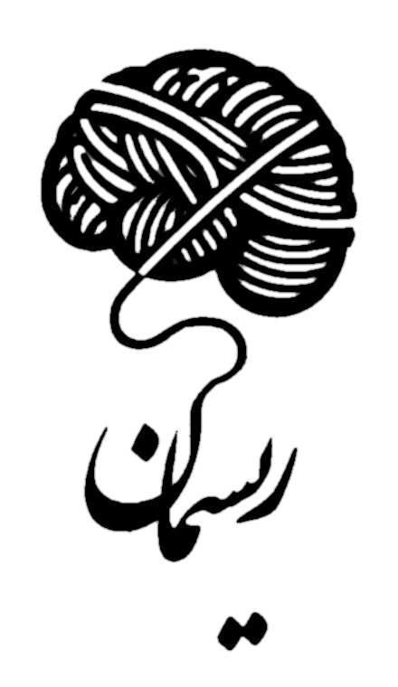

# Risman Journal · نشریه ریسمان

<p align="center">
  
</p>

<p align="center">
  <strong>An editorial journal exploring psychology and the human mind.</strong><br>
  <em>Faculty of Humanities · Science and Research Branch, Islamic Azad University (SRBIAU), Tehran</em>
</p>

<p align="center">
  <a href="https://github.com/adudewithcookie/Risman-Journal/actions"></a>
  
  
  
  
</p>

---

## Overview

**Risman** (ریسمان) is an academic and editorial journal founded on **November 11, 2023** (**۲۰ آبان ۱۴۰۲**) at the Faculty of Humanities, Islamic Azad University Science and Research Branch (SRBIAU) in Tehran.

The website serves as a quiet meeting ground between an academic archive and a contemporary editorial publication. Readers can browse through all published issues, view metadata and editorial dossiers, and read each full publication directly within an in-browser reader.

### Core Disciplines

Risman curates research, essays, and critical discussions across five primary domains of psychology:
- **Cognitive Psychology** (روان‌شناسی شناختی)
- **Child & Adolescent Psychology** (روان‌شناسی کودک و نوجوان)
- **Personality Psychology** (روان‌شناسی شخصیت)
- **General Psychology** (روان‌شناسی عمومی)
- **Philosophy of Psychology** (فلسفه روان‌شناسی)

---

## Key Features

- **Full Bilingual Localization (English & Persian)**:
  - Instant LTR ↔ RTL switching with persistent user preference in `localStorage`.
  - Curated typography tuned to each script: *Playfair Display* and *DM Sans* for Latin; *Rokh (رخ)*, *IRANSans*, and *Vazirmatn* for Persian.
  - Dedicated translation dictionary in [`assets/js/i18n.js`](assets/js/i18n.js).

- **Dynamic 3D Earth Globe**:
  - Interactive HTML5 canvas orthographic projection featuring Earth with realistic rotation physics, mouse/touch drag controls, and a celestial field of 120 cosmic stars.
  - Pinned directly to the journal's birthplace at SRBIAU coordinates: `35.7978° N · 51.3205° E` (1,780m ALT).

- **Stripe Press–Style 3D Book Experience**:
  - Interactive 3D physical book rendering with realistic paper thickness, binding, edge gradients, and hover perspective tilt.

- **Authentic Persian Nastaliq Background Watermark**:
  - Faded calligraphic «ریسمان» watermark placed along the left edge, matching the layout of the print issue masthead.
  - Rendered via CSS `mask-image` to seamlessly adapt to light and dark themes without compromising reading contrast.

- **Integrated Browser PDF Reader**:
  - Distraction-free reader (`/read/?issue=08`) with URL query routing, direct fallback links, and responsive viewing.

- **Editorial Frosted Glass Navigation**:
  - Mobile menu with `backdrop-filter: blur(28px)`, containing full page navigation alongside built-in theme and language switchers.

- **Dual Color Themes**:
  - Warm Ivory (`#F4F3EA`) light mode and Deep Navy (`#0F131F`) dark mode, honoring OS preferences on initial visit with manual toggle override.

- **Zero Build, Zero Runtime Dependencies**:
  - 100% standard web technologies (semantic HTML5, modern CSS3, vanilla ES6+).
  - No bundler, no framework overhead, and instant load times.

---

## Pages

| Route | Purpose |
| --- | --- |
| [`/`](index.html) | Homepage with hero manifesto, interactive Earth globe, latest issue spotlight, and archive preview |
| [`/issues/`](issues/index.html) | Complete archive catalog of published issues with 3D cover cards and direct links |
| [`/about/`](about/index.html) | Institutional editorial dossier, mission statement, focus areas, and history |
| [`/read/?issue=XX`](read/index.html) | Full-screen browser reader for selected issues with responsive fallbacks |

---

## Project Structure

```text
.
├── index.html                      # Homepage
├── about/
│   └── index.html                  # Editorial dossier & journal story
├── issues/
│   └── index.html                  # Complete issue archive
├── read/
│   └── index.html                  # In-browser publication reader
├── assets/
│   ├── covers/                     # Issue cover art (3:4 aspect ratio)
│   │   ├── issue-01.jpg
│   │   └── ...
│   ├── css/
│   │   └── styles.css              # Unified design system & RTL rules
│   ├── fonts/                      # Local typography assets
│   │   └── OpenSans-Regular.ttf
│   ├── icons/                      # Branding & iconography
│   │   ├── risman-mark.png         # Official journal brand mark & favicon
│   │   └── risman-nastaliq.png     # Persian Nastaliq calligraphy watermark
│   ├── issues/                     # Publication PDFs
│   │   ├── issue-01.pdf
│   │   └── ...
│   ├── js/                         # Application scripts
│   │   ├── i18n.js                 # Persian dictionary & RTL logic
│   │   ├── issues-data.js          # Canonical issue metadata dataset
│   │   └── main.js                 # Globe, 3D books, theme & menu logic
│   └── social/
│       └── risman-og.jpg           # Open Graph social sharing image
├── tests/                          # Automated Node.js test suites
│   ├── i18n-social.test.js         # Localization, RTL & social link tests
│   ├── issues.test.js              # Issue dataset validation
│   ├── mobile-menu-spacing.test.js # Frosted menu & typography checks
│   ├── redesign-typography-map.test.js # Coordinates & globe tests
│   └── site.test.js                # Core site integrity & brand checks
├── .nojekyll                       # GitHub Pages Jekyll bypass
├── robots.txt                      # Search engine crawlers directive
├── sitemap.xml                     # Search engine sitemap
└── vercel.json                     # Vercel clean URL & routing config
```

---

## Local Development

Because the reader checks and streams PDF files via HTTP requests, run a local web server rather than opening files directly from the filesystem:

Using Python:
```bash
python3 -m http.server 8080
```

Or using Node.js:
```bash
npx serve .
```

Then visit [http://localhost:8080](http://localhost:8080).

---

## Managing Issues & Content

### 1. Adding or Modifying Issues
All issues are defined in [`assets/js/issues-data.js`](assets/js/issues-data.js):

```javascript
{
  number: "08",
  title: "Sometimes, The Path Itself Must Be Seen",
  title_fa: "گاهی باید خودِ مسیر را نگریست",
  tag_en: "Mind & Consciousness",
  tag_fa: "ذهن و آگاهی",
  pages: "68 pp.",
  pages_fa: "۶۸ صفحه",
  date_en: "Winter 2024",
  date_fa: "زمستان ۱۴۰۲",
  description: "A study of cognitive depths and shared human perception.",
  description_fa: "پژوهشی در اعماق شناختی و ادراک مشترک انسانی.",
  cover: "assets/covers/issue-08.jpg",
  pdf: "assets/issues/issue-08.pdf",
  featured: true
}
```

- Keep issues ordered from newest to oldest.
- Ensure `cover` (portrait 3:4 ratio, ideally `1200 × 1600 px`) and `pdf` files exist in their respective directories.
- Set `featured: true` on the single issue to highlight on the homepage.

---

## Automated Verification

Run all test suites locally with Node.js:

```bash
node tests/site.test.js
node tests/issues.test.js
node tests/i18n-social.test.js
node tests/redesign-typography-map.test.js
node tests/mobile-menu-spacing.test.js
```

---

## Deployment

### Vercel (Recommended)
This repository is pre-configured with [`vercel.json`](vercel.json):
1. Import the repository into [Vercel](https://vercel.com).
2. Set **Framework Preset** to **Other**.
3. Leave **Build Command** empty and set **Output Directory** to `.`.
4. Deploy.

### GitHub Pages
1. Navigate to repository **Settings** → **Pages**.
2. Under **Build and deployment**, select **Deploy from a branch**.
3. Set branch to `main` and folder to `/ (root)`.
4. The included `.nojekyll` file ensures static assets are served without modification.

---

## Editorial Information

- **Institution**: Islamic Azad University, Science and Research Branch (دانشگاه آزاد اسلامی واحد علوم و تحقیقات)
- **Faculty**: Faculty of Humanities (دانشکده علوم انسانی)
- **ISSN**: `3041-8852`
- **Founded**: November 11, 2023 · ۲۰ آبان ۱۴۰۲
- **Telegram**: [@Rismanmagazine](https://t.me/Rismanmagazine)
- **Instagram**: [@rismanmagazine](https://instagram.com/rismanmagazine)

---

## License

All content, writing, publication PDFs, covers, and brand artwork are copyright © Risman Journal and their respective contributors. All rights reserved.
